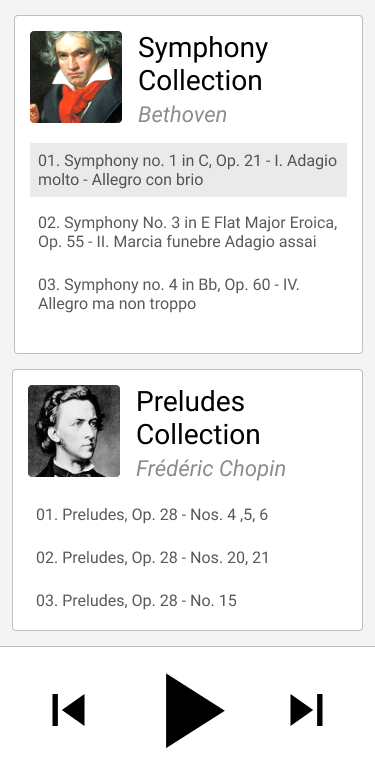

# Music Player

## Pré-requisitos

- Node.js 16+
- Yarn (usar `npm` pode causar erros na instalação dos pacotes)
- Não utilizar nenhuma biblioteca além das que já estão instaladas (seja de CSS ou JS)

## Passo 1

- Instalar as dependências
- Ver o teste "quebrar" rodando `yarn test`
- Escrever as classes para passar nos testes (Jest)

## Passo 2

- Criar a interface baseada no [protótipo do Figma](https://www.figma.com/file/V2LUvZCm5AW92nCjtCcM8A/Music-Player)
- Fazer a aplicação responsiva utilizando as classes criadas no passo anterior
- Testar usando os comandos `yarn start`

## Sugestões

- Faça bom uso de variáveis CSS
- Utilize os recursos mais novos de JavaScript (ESNext)
- Encapsule as propriedades das classes (impedir valores inválidos em atribuições diretas)

## O que será avaliado

- Todos os testes cumpridos
- Fidelidade ao protótipo
- Responsividade
- Estrutura do código
- Gerenciamento de estados (store/state/etc)
- Uso de boas práticas (legibilidade, código limpo, etc)
- Aplicativo funcionando com músicas tocando e faixas sendo trocadas (utilizar o arquivo da pasta `mocks`)
- Funcionalidades adicionais são bem-vindas (use sua criatividade)

## Resultado experado

